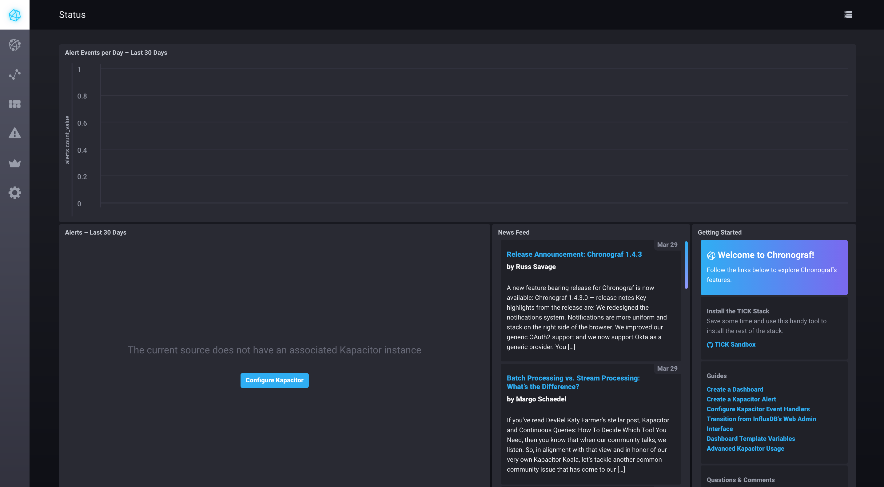
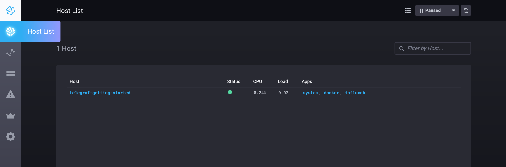

# Industrial IoT and Data Analytics Platform (IDA)

### การเรียนรู้ URCONNECT

1.VTR แนะนำการใช้งาน URCONNECT
หน่วยตรวจวัดระยะไกลยูนิเวอร์แซล
http://bit.ly/URCONNECT_Training
2.เอกสาร URCONNECT ประกอบการเรียนรู้
http://bit.ly/URCONNECT_DOCS
3.downdload โปรแกรม เพื่อตั้งค่าการใช้งาน URCONNECT ที่ https://drive.google.com/file/d/149IUYGg_x62d3wxUEbrIh0OkvESbSP2E/view?usp=sharing
4.downdload โปรแกรมเพื่อ
- เพิ่มให้สามารถ Edit ค่าในการ Calibrate ในส่วนการ 4-20mA PT100 และ 0-5V
- เพิ่มให้การตั้งค่า Forward Address ใช้งานได้ง่ายขึ้น สามารถ Downdload Program ได้ที่ https://drive.google.com/file/d/1BhzbH-TM64o_TxEj29R2MCbX4T2IfkMj/view?usp=sharing
การเรียนรู้ NETPIE เบื้องต้น
1.ดาวน์โหลดเอกสารและตัวอย่างโปรแกรมสำหรับการฝึกอบรมได้ที่ลิงค์ข้างล่างนี้
https://bit.ly/2Wbrp6y
NETPIE2020 Training Playlist http://bit.ly/NETPIE_PLAYLIST
เรียนรู้การตั้งค่าอุปกรณ์ URCONNECT +Sensors +PT100
1. VTR สาธิตการตั้งค่าอุปกรณ์ URCONNECT +Sensors +PT100
ตอนที่1 Architecture IDA ฮาร์ดแวร์ และ ตัวอย่าง Gateway ได้ที่่ https://rb.gy/l2xy8y
ตอนที่ 2 แนะนำซอฟต์แวร์ เพื่อการติดตั้งและการใช้งาน ได้ที่ https://rb.gy/oba1bf
ตอนที่ 3 การติดตั้ง Mod-bus เพื่อสื่อสาร URCONNECT ได้ที่ https://rb.gy/eu0sic
2. เอกสารประกอบ การสาธิตการตั้งค่าอุปกรณ์ URCONNECT +Sensors +PT100 ทุกตอนได้ที่ https://rb.gy/uf7j0t

To get started you need a running docker installation. If you don't have one, you can download Docker for [Mac](https://www.docker.com/docker-mac) or [Windows](https://www.docker.com/docker-windows), or follow the installation instructions for Docker CE for your [Linux distribution](https://docs.docker.com/engine/installation/#server).

### Running

To run the `idahub`, simply use the convenient cli:

```bash
$ ./idahub
idahub commands:
  up           -> spin up the idahub environment (add -nightly to grab the latest nightly builds of InfluxDB and Chronograf)
  down         -> tear down the idahub environment
  restart      -> restart the idahub
  influxdb     -> attach to the influx cli
  flux         -> attach to the flux REPL

  enter (influxdb||kapacitor||chronograf||telegraf) -> enter the specified container
  logs  (influxdb||kapacitor||chronograf||telegraf) -> stream logs for the specified container

  delete-data  -> delete all data created by the TICK Stack
  docker-clean -> stop and remove all running docker containers
  rebuild-docs -> rebuild the documentation container to see updates
```

To get started just run `./idahub up`. You browser will open two tabs:

- `localhost:8888` - Chronograf's address. You will use this as a management UI for the full stack
- `localhost:3010` - Documentation server. This contains a simple markdown server for tutorials and documentation.

> NOTE: Make sure to stop any existing installations of `influxdb`, `kapacitor` or `chronograf`. If you have them running the idahub will run into port conflicts and fail to properly start. In this case stop the existing processes and run `./idahub restart`. Also make sure you are **not** using _Docker Toolbox_.

Once the idahub launches, you should see your dashboard appear in your browser:



You are ready to get started with the TICK Stack!

Click the Host icon in the left navigation bar to see your host (named `telegraf-getting-started`) and its overall status.


You can click on `system` hyperlink to see a pre-built dashboard visualizing the basic system stats for your
host, then check out the tutorials at `http://localhost:3010/tutorials`.

If you are using the nightly builds and want to get started with Flux, make sure you check out the [Getting Started with Flux](./documentation/static/tutorials/flux-getting-started.md) tutorial.

> Note: see [influx-stress](https://github.com/influxdata/influx-stress) to create data for your idahub.


