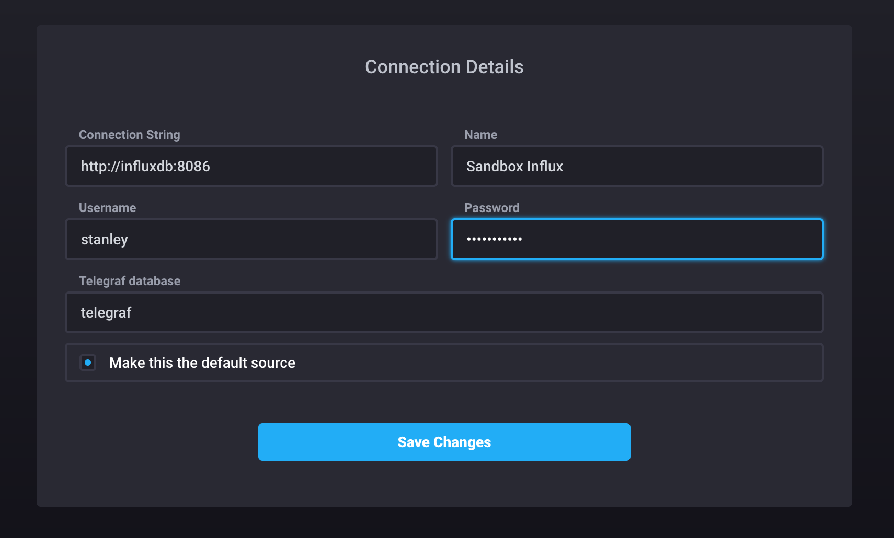

# Enabling Authentication

First you will need to create an [admin user](https://docs.influxdata.com/influxdb/v1.4/query_language/authentication_and_authorization/#authorization) on your influxdb instance:

```
$ ./edgehub influxdb
...
> CREATE USER "stanley" WITH PASSWORD 'stellllAAAA' WITH ALL PRIVILEGES
> SHOW USERS
user    admin
----    -----
stanley true
```

Then change the [`[http] auth-enabled` variable](https://docs.influxdata.com/influxdb/v1.4/query_language/authentication_and_authorization/#set-up-authentication) in the configuration file at `./influxdb/config/influxdb.conf` to true. Then you will need to add this username and password to both the telegraf and kapacitor configuration files:

```
# ./influxdb/config/influxdb.conf
[http]
  auth-enabled = true

# ./kapacitor/config/kapacitor.conf
[[influxdb]]
  username = 'stanley'
  password = 'stellllAAAA'

# ./telegraf/telegraf.conf
[[outputs.influxdb]]
  username = 'stanley'
  password = 'stellllAAAA'
```

Also make sure to add the credentials in the Chronograf instance:



Once those steps are completed then you need to restart the edgehub to ensure authentication is enforced:

```
$ ./edgehub restart
Stopping all processes...
Starting all processes...
Services available!
$
```
